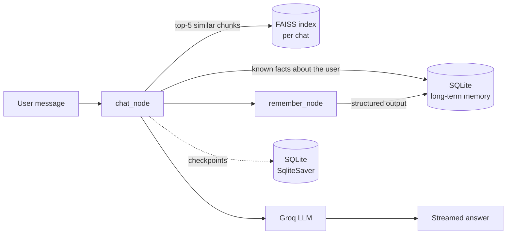

<div align="center">

# Lumen

**Chat with your documents. Lumen remembers you.**

A conversational AI assistant built with LangGraph, with retrieval-augmented answers from your own files, long-term memory across chats, and a clean chat-management interface.


[Live demo](https://lumenbot.streamlit.app/) | [Features](#features) | [How it works](#how-it-works) | [Getting started](#getting-started) | [Roadmap](#roadmap)

</div>

---


## Overview

Lumen is a full-stack chatbot that goes beyond a simple prompt-and-response loop. Every conversation is persisted, every chat can hold its own documents, and the assistant carries what it learns about you from one chat to the next.

The project demonstrates a complete GenAI application: a stateful LangGraph workflow, a retrieval pipeline built from scratch, structured-output memory extraction, and a polished Streamlit interface, all running on a free-tier stack.

## Features

**Conversation**
- Streaming responses, token by token
- Answers formatted in clean Markdown: headings, bold key terms, `inline code` for file names and commands, tables for comparisons, fenced code blocks with syntax highlighting
- Every conversation is saved and can be reopened at any time

**Chat with your documents (RAG)**
- Upload PDF, DOCX, TXT, and Markdown files from the sidebar
- Each chat has its own private vector index
- Answers cite the source file and page number
- When the documents do not contain the answer, Lumen says so instead of inventing one

**Long-term memory**
- Lumen extracts durable facts you share (your name, projects, preferences) and stores them
- Those facts are injected into every future chat, so a brand-new conversation still knows who you are
- Memory extraction uses structured output, so only clean facts are stored

**Chat management**
- Topic-based titles generated automatically, for example "Paneer recipe" instead of a raw ID
- Pin important chats to the top
- Rename and delete chats from a per-chat menu
- Search conversations from the sidebar
- Deleting a chat removes its messages, documents, and vector index

## How it works



### The LangGraph workflow

The graph has two nodes that run in sequence for every message:

1. **`chat_node`** builds the system prompt, retrieves relevant document chunks for the current chat, adds stored facts about the user, and calls the model.
2. **`remember_node`** runs a second, structured-output model call that extracts any new durable facts from the user's message and saves them.

Conversation state is checkpointed with `SqliteSaver`, keyed by a per-chat `thread_id`. This is the short-term memory. The separate `user_memory` table is the long-term memory that survives across threads.

### The RAG pipeline

| Stage | Implementation |
|---|---|
| Load | `PyPDFLoader`, `Docx2txtLoader`, plain-text reader |
| Split | `RecursiveCharacterTextSplitter` (900 characters, 150 overlap) |
| Embed | `sentence-transformers/all-MiniLM-L6-v2`, running locally |
| Store | FAISS index saved to disk, one per chat |
| Retrieve | Top 5 chunks by similarity for each user message |
| Generate | Chunks passed to the model with instructions to cite file and page |

## Tech stack

| Layer | Technology |
|---|---|
| Orchestration | LangGraph, LangChain |
| LLM | Groq API (`openai/gpt-oss-20b`) |
| Embeddings | Sentence Transformers via `langchain-huggingface` |
| Vector store | FAISS |
| Persistence | SQLite (`langgraph-checkpoint-sqlite`) |
| Interface | Streamlit |
| Document parsing | pypdf, docx2txt |

## Getting started

### Prerequisites

- Python 3.11 or newer
- A free Groq API key from [console.groq.com](https://console.groq.com)

### Installation

```bash
git clone https://github.com/DibyanshYadav/Lumen.git
cd Lumen

python -m venv venv
# Windows
venv\Scripts\activate
# macOS / Linux
source venv/bin/activate

pip install -r requirements.txt
```

### Configuration

Create a `.env` file in the project root:

```
GROQ_API_KEY=your_key_here
```

### Run

```bash
python -m streamlit run chatbot_frontend.py
```

The app opens at `http://localhost:8501`. The database (`chatbot.db`) and the `vectorstores/` folder are created automatically on first run. The embedding model (about 90 MB) downloads the first time you upload a document.

### Try it

1. Tell Lumen your name, then open **New Chat** and ask what your name is.
2. Upload a PDF and ask for a summary, or ask about a specific page.
3. Pin, rename, and search your conversations from the sidebar.

## Project structure

```
Lumen/
├── chatbot_backend.py     # LangGraph workflow, RAG pipeline, memory, SQLite helpers
├── chatbot_frontend.py    # Streamlit interface: chat, sidebar, dialogs, uploads
├── requirements.txt
├── .gitignore
└── README.md
```

Created at runtime and excluded from version control: `chatbot.db`, `vectorstores/`, `.env`.

## Design decisions

- **Titles are separate from thread IDs.** The `thread_id` stays a UUID because LangGraph uses it as the checkpoint key. Human-readable titles live in their own table, so renaming never touches conversation state.
- **Two kinds of memory, on purpose.** Checkpoints give per-chat continuity. A separate fact table gives cross-chat continuity. Mixing them would leak one chat's context into another.
- **Streaming is filtered by node.** `stream_mode="messages"` emits tokens from every model call in the graph, so the frontend keeps only tokens from `chat_node`. Without this filter, the memory-extraction call would appear in the chat window.
- **Per-chat vector stores.** Each chat gets its own FAISS index, so documents from one conversation can never surface in another.
- **Lazy model loading.** The embedding model loads on first use, which keeps application startup fast.
- **Structured output for memory.** Facts are extracted into a typed schema instead of free text, which keeps the memory table clean and deduplicated.

## Deployment

Lumen deploys to [Streamlit Community Cloud](https://streamlit.io/cloud):

1. Push the repository to GitHub.
2. Create a new app with `chatbot_frontend.py` as the main file and Python 3.12.
3. Add your key under **Secrets**:
   ```toml
   GROQ_API_KEY = "your_key_here"
   ```

## Known limitations

- **No user accounts yet.** All visitors to a deployed instance share the same chats, documents, and memory.
- **Temporary storage on free hosting.** SQLite and the vector indexes live on the server's disk, which resets when the app restarts.
- **Text-based documents only.** Scanned PDFs (images of text) are not supported without OCR.
- **Search matches chat titles**, not the text inside messages.

## Roadmap

- [ ] User authentication with Supabase Auth
- [ ] Per-user chats, documents, and long-term memory
- [ ] Persistent storage with Supabase Postgres and LangGraph's `PostgresSaver`
- [ ] OCR support for scanned PDFs
- [ ] Full-text search across message content
- [ ] Hybrid retrieval with reranking for better answer quality
- [ ] Memory viewer, so users can see and delete what Lumen has remembered

## Author

**Dibyansh Yadav**

Built as part of a GenAI and ML portfolio focused on agentic AI, RAG, and LangGraph.

[GitHub](https://github.com/DibyanshYadav)
